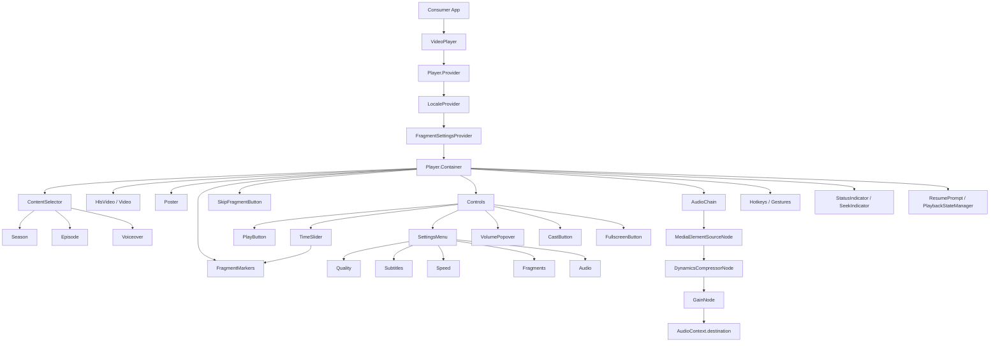

<div align="center">
  
</div>

<br clear="right">

<h1 align="center">🎬 EvadePlayer</h1>

<p align="center">
  <strong>A React video player powered by Video.js — also available as a framework-agnostic Web Component</strong>
</p>

<p align="center">
  HLS streaming · accessible controls · audio processing · content navigation · fragment skip
</p>

<p align="center">
  <a href="https://react.dev"></a>
  <a href="https://videojs.com"></a>
  <a href="https://www.typescriptlang.org"></a>
  <a href="https://vite.dev"></a>
  <a href="LICENSE"></a>
  <br>
  <a href="https://www.npmjs.com/package/evade-player"></a>
  <a href="https://bundlephobia.com/package/evade-player"></a>
</p>

<p align="center">
  <a href="#quick-start">Quick Start</a> ·
  <a href="#usage">Usage</a> ·
  <a href="#web-component">Web Component</a> ·
  <a href="#public-api">API</a> ·
  <a href="#architecture">Architecture</a> ·
  <a href="#development">Development</a> ·
  <a href="#related">Related</a>
</p>

<br>

<p align="center">
  
</p>

<br>

---

<a name="about"></a>
## About

EvadePlayer is a full-featured video player built on [Video.js v10](https://videojs.com), available as a **React component** and as a **framework-agnostic Web Component** (`<evade-player>`).

| Capability | Description |
|---|---|
| 🎞️ **HLS Streaming** | Adaptive bitrate playback via hls.js |
| ♿ **Accessible Controls** | Keyboard navigation, screen reader, focus management |
| 🔊 **Audio Processing** | Volume boost + dynamic range compression (Web Audio API) |
| 🧩 **Content Navigation** | Season / episode / voiceover selector |
| ⏭️ **Fragment Skip** | Colored timeline markers + auto-skip for openings, endings, previews |
| 🖼️ **Thumbnail Previews** | Storyboard-based timeline hover previews |
| 🌐 **Localization** | Russian and English UI (extensible via `LocaleProvider`) |
| 💾 **State Persistence** | Remembers position, settings, preferences in `localStorage` |
| 📦 **Web Component** | Works in any framework — React, Vue, Svelte, Angular, or plain HTML |

This is the **frontend** — the player UI. The backend that handles uploading, transcoding, and serving video lives in a separate repository:

> [github.com/leo-need-more-coffee/evadeplayer-platform](https://github.com/leo-need-more-coffee/evadeplayer-platform)  
> Go + ffmpeg + nginx — upload, transcode to HLS, serve with signed URLs

---

<a name="quick-start"></a>
## Quick Start

### React (npm)

```bash
npm install evade-player
```

```tsx
import { VideoPlayer } from 'evade-player';
import 'evade-player/skins/default/skin.css';

function App() {
  return (
    <VideoPlayer
      src="https://example.com/video.m3u8"
      poster="https://example.com/poster.jpg"
    />
  );
}
```

### Any framework / no framework (script tag)

```html
<link rel="stylesheet" href="https://cdn.jsdelivr.net/npm/evade-player/dist/evade-player.css">
<script src="https://cdn.jsdelivr.net/npm/evade-player/dist/evade-player.js"></script>

<evade-player
  id="player"
  src="https://example.com/video.m3u8"
  poster="https://example.com/poster.jpg"
></evade-player>
```

### Dev server with demo app

```bash
npm ci
npm run dev
```

The demo app will be available at `http://localhost:5173`.

---

<a name="usage"></a>
## Usage

### Basic

```tsx
import { VideoPlayer } from 'evade-player';

<VideoPlayer
  src="https://stream.mux.com/abc123/highlight.mp4"
  poster="https://image.mux.com/abc123/thumbnail.webp"
/>
```

### With quality selection

```tsx
<VideoPlayer
  src="https://example.com/master.m3u8"
  qualities={[
    { label: '1080p', src: 'https://example.com/1080.m3u8' },
    { label: '720p',  src: 'https://example.com/720.m3u8' },
    { label: '480p',  src: 'https://example.com/480.m3u8' },
  ]}
/>
```

### With thumbnail storyboard

```tsx
<VideoPlayer
  src="https://example.com/master.m3u8"
  thumbnailStoryboardSrc="https://example.com/video/storyboard"
/>
```

The storyboard endpoint should return a JSON array:

```json
[
  { "url": "https://example.com/sprite.jpg", "start_time": 0, "end_time": 10 },
  { "url": "https://example.com/sprite.jpg", "start_time": 10, "end_time": 20 }
]
```

### With season, episode, and voiceover selection

```tsx
<VideoPlayer
  src="https://example.com/master.m3u8"
  seasons={[
    {
      label: 'Season 1',
      value: 's1',
      episodes: [
        {
          label: 'Episode 1',
          value: 's1e1',
          voiceovers: [
            { label: 'Russian', value: 'ru' },
            { label: 'English', value: 'en' },
          ],
        },
        {
          label: 'Episode 2',
          value: 's1e2',
          voiceovers: [
            { label: 'Russian', value: 'ru' },
            { label: 'English', value: 'en' },
          ],
        },
      ],
    },
  ]}
  currentSeason="s1"
  currentEpisode="s1e1"
  currentVoiceover="ru"
  onSeasonChange={(value) => console.log('Season:', value)}
  onEpisodeChange={(value) => console.log('Episode:', value)}
  onVoiceoverChange={(value) => console.log('Voiceover:', value)}
/>
```

All props are optional. The episodes dropdown automatically shows episodes from the selected season. Voiceovers are nested within each episode. Selectors appear in the top-right corner.

### With fragment markers and skip

```tsx
<VideoPlayer
  src="https://example.com/episode.m3u8"
  fragments={[
    { type: 'opening', startTime: 0, endTime: 90 },
    { type: 'ending', startTime: 1380, endTime: 1440 },
    { type: 'preview', startTime: 1440, endTime: 1470 },
  ]}
  fragmentSettings={{
    autoSkipOpening: true,
    autoSkipEnding: false,
    autoSkipPreview: false,
    autoSkipCompilation: false,
  }}
/>
```

Fragment segments appear as colored markers on the timeline. A skip button appears when playback enters a fragment. Auto-skip can be configured per fragment type in the settings menu or via the `fragmentSettings` prop.

### With locale

```tsx
<VideoPlayer
  src="https://example.com/video.m3u8"
  locale="ru"   // or "en"
/>
```

All UI strings adapt to the selected locale. The `locale` prop defaults to `"ru"`.

### With playback state persistence

```tsx
import { useState } from 'react';
import { VideoPlayer, type PlaybackState } from 'evade-player';

function App() {
  const [state, setState] = useState<PlaybackState | null>(null);

  return (
    <VideoPlayer
      src="https://example.com/video.m3u8"
      savedState={state}
      onSaveState={(s) => setState(s)}
    />
  );
}
```

The player shows a "Continue from X?" prompt when returning to a partially-watched video. State is also persisted to `localStorage` automatically.

### Audio boost and normalization

```tsx
import { applyVolumeBoost, applyNormalization } from 'evade-player';

applyVolumeBoost(2);       // 2x gain
applyNormalization('light'); // 'off' | 'light' | 'medium' | 'strong'
```

---

<a name="web-component"></a>
## Web Component

The player is also available as a framework-agnostic custom element `<evade-player>`. It works in any JavaScript environment — React, Vue, Svelte, Angular, or plain HTML.

### Quick start (from CDN)

Two options — **self-contained** (React bundled) or **thin** (load React separately).

#### Option A: Self-contained (~385 kB gzip)

```html
<link rel="stylesheet" href="https://cdn.jsdelivr.net/npm/evade-player/dist/evade-player.css">
<script src="https://cdn.jsdelivr.net/npm/evade-player/dist/evade-player.js"></script>

<evade-player
  id="player"
  src="https://example.com/video.m3u8"
  poster="https://example.com/poster.jpg"
  locale="ru"
></evade-player>
```

Everything in one script. Nothing else to load.

#### Option B: Thin with React shared (~212 kB gzip)

Use when React is already on the page, or to share the React cache with other scripts:

```html
<link rel="stylesheet" href="https://cdn.jsdelivr.net/npm/evade-player/dist/evade-player.css">
<script src="https://cdn.jsdelivr.net/npm/react@19/umd/react.production.min.js"></script>
<script src="https://cdn.jsdelivr.net/npm/react-dom@19/umd/react-dom.production.min.js"></script>
<script src="https://cdn.jsdelivr.net/npm/evade-player/dist/evade-player.thin.js"></script>

<evade-player
  id="player"
  src="https://example.com/video.m3u8"
></evade-player>
```

### Passing complex data

Complex props (arrays, objects) are set via JavaScript properties on the element:

```html
<evade-player id="player" src="https://example.com/master.m3u8"></evade-player>
<script>
  const player = document.getElementById('player');

  player.seasons = [
    {
      label: 'Season 1',
      value: 's1',
      episodes: [
        {
          label: 'Episode 1',
          value: 's1e1',
          voiceovers: [
            { label: 'Russian', value: 'ru' },
            { label: 'English', value: 'en' },
          ],
        },
      ],
    },
  ];

  player.fragments = [
    { type: 'opening', startTime: 0, endTime: 90 },
    { type: 'ending', startTime: 1380, endTime: 1440 },
  ];

  player.currentSeason = 's1';
  player.currentEpisode = 's1e1';
  player.currentVoiceover = 'ru';
</script>
```

### Listening to events

React callbacks are mapped to Custom Events:

```js
player.addEventListener('seasonchange', (e) => console.log('Season:', e.detail.value));
player.addEventListener('episodechange', (e) => console.log('Episode:', e.detail.value));
player.addEventListener('voiceoverchange', (e) => console.log('Voiceover:', e.detail.value));
player.addEventListener('savestate', (e) => console.log('Saved state:', e.detail.state));
```

### All element properties

| Property | Type | Via attribute |
|---|---|---|
| `src` | `string` | ✅ `src` |
| `poster` | `string \| undefined` | ✅ `poster` |
| `thumbnailStoryboardSrc` | `string \| undefined` | ✅ `thumbnail-storyboard-src` |
| `errorDescription` | `string \| undefined` | ✅ `error-description` |
| `currentSeason` | `string \| undefined` | ✅ `current-season` |
| `currentEpisode` | `string \| undefined` | ✅ `current-episode` |
| `currentVoiceover` | `string \| undefined` | ✅ `current-voiceover` |
| `locale` | `"ru" \| "en" \| undefined` | ✅ `locale` |
| `qualities` | `QualityOption[]` | ❌ (JS only) |
| `seasons` | `SeasonOption[]` | ❌ (JS only) |
| `fragments` | `Fragment[]` | ❌ (JS only) |
| `fragmentSettings` | `Partial<FragmentSettings>` | ❌ (JS only) |
| `savedState` | `PlaybackState \| null \| undefined` | ❌ (JS only) |
| `playerClass` | `string \| undefined` | ❌ (JS only) |

### Supported events

| Event | `detail` shape |
|---|---|
| `seasonchange` | `{ value: string }` |
| `episodechange` | `{ value: string }` |
| `voiceoverchange` | `{ value: string }` |
| `savestate` | `{ state: PlaybackState }` |

### Build your own bundle

```bash
npm run build:standalone          # Self-contained  ~385 kB gzip
npm run build:standalone:thin     # React external  ~212 kB gzip
npm run build:standalone:all      # Both
```

Outputs to `dist/`:
- `evade-player.js` / `.mjs` — IIFE + ESM, all deps bundled
- `evade-player.thin.js` / `.mjs` — IIFE + ESM, requires `React` / `ReactDOM` on `window`
- `evade-player.css` — shared styles

---

<a name="public-api"></a>
## Public API

### Components

| Export | Description |
|---|---|
| `VideoPlayer` | Main player component (React) |
| `Player` | Video.js store (Provider + Container) |
| `EvadePlayerElement` | Custom element class (`<evade-player>`) |
| `LocaleProvider` | Locale context provider (used internally) |

### VideoPlayer Props

| Prop | Type | Description |
|---|---|---|
| `src` | `string` | Video source URL |
| `poster` | `string \| undefined` | Poster image URL |
| `qualities` | `QualityOption[]` | Quality variants for manual selection |
| `thumbnailStoryboardSrc` | `string` | Storyboard JSON endpoint for timeline previews |
| `seasons` | `SeasonOption[]` | Season/episode/voiceover hierarchy |
| `currentSeason` | `string` | Current season value (derived from episode if omitted) |
| `currentEpisode` | `string` | Current episode value (e.g. `"s1e3"`) |
| `currentVoiceover` | `string` | Current voiceover/dub value |
| `onSeasonChange` | `(value: string) => void` | Season change callback |
| `onEpisodeChange` | `(value: string) => void` | Episode change callback |
| `onVoiceoverChange` | `(value: string) => void` | Voiceover change callback |
| `savedState` | `PlaybackState \| null` | External playback state to restore |
| `onSaveState` | `(state: PlaybackState) => void` | Callback when state is saved |
| `fragments` | `Fragment[]` | Fragment segments (opening, ending, etc.) |
| `fragmentSettings` | `Partial<FragmentSettings>` | Default auto-skip config per fragment type |
| `locale` | `"ru" \| "en"` | UI language (default `"ru"`) |
| `errorDescription` | `string` | Custom error message |
| `style` | `CSSProperties` | Inline styles on the player container |
| `className` | `string` | Additional CSS class on the player container |

### Types

| Export | Description |
|---|---|
| `VideoPlayerProps` | Player component props |
| `QualityOption` | Quality variant option |
| `SeasonOption` | Season selection option (with episodes) |
| `EpisodeOption` | Episode selection option (with voiceovers) |
| `VoiceoverOption` | Voiceover / dub option |
| `SubtitleOption` | Subtitle track option |
| `AudioOption` | Audio track option |
| `SubtitleAppearance` | Subtitle style settings |
| `SubtitleSettingOption` | Subtitle style option |
| `SubtitleSettingsView` | Subtitle settings view key |
| `SettingsView` | Settings menu view key |
| `PlaybackState` | Saved playback position and context |
| `PlayerSettings` | Persistent player preferences |
| `Fragment` | Fragment segment (opening, ending, etc.) |
| `FragmentType` | Fragment type union string |
| `FragmentSettings` | Auto-skip configuration per fragment type |
| `Locale` | Supported locale (`"ru" \| "en"`) |
| `AudioChainDebugInfo` | Audio chain debug state |

### Audio Functions

| Export | Description |
|---|---|
| `applyVolumeBoost` | Set gain factor (0.5, 1, 2, 3…) |
| `applyNormalization` | Set compressor level (off/light/medium/strong) |
| `resumeOnUserInteraction` | Resume AudioContext on user gesture |
| `setMediaElement` | Attach a media element to the chain |
| `getAudioChainDebugInfo` | Get current audio chain state |

### State Persistence Functions

| Export | Description |
|---|---|
| `savePlaybackState` | Save playback position and context to localStorage |
| `loadPlaybackState` | Load saved playback state from localStorage |
| `clearPlaybackState` | Clear saved playback state from localStorage |
| `savePlayerSettings` | Save player preferences (volume, subtitles, etc.) |
| `loadPlayerSettings` | Load saved player preferences from localStorage |
| `clearPlayerSettings` | Clear saved player preferences from localStorage |

### Preset Constants

| Export | Description |
|---|---|
| `VOLUME_BOOST_OPTIONS` | Boost preset list (50–300%) |
| `NORMALIZATION_OPTIONS` | Level preset list |
| `DEFAULT_VOLUME_BOOST` | Default boost value |
| `DEFAULT_NORMALIZATION` | Default normalization level |
| `DEFAULT_SUBTITLE_APPEARANCE` | Default subtitle style |
| `SUBTITLE_FONT_SIZE_OPTIONS` | Font size presets |
| `SUBTITLE_COLOR_OPTIONS` | Text color presets |
| `SUBTITLE_BG_OPTIONS` | Background color presets |
| `SUBTITLE_EDGE_STYLE_OPTIONS` | Edge style presets |
| `SUBTITLE_FONT_FAMILY_OPTIONS` | Font family presets |
| `SUBTITLE_POSITION_OPTIONS` | Position presets |
| `DEFAULT_FRAGMENT_SETTINGS` | Default auto-skip fragment config |
| `FRAGMENT_COLORS` | Color map per fragment type |

### Localisation Exports

| Export | Description |
|---|---|
| `getFragmentLabel` | Get localized fragment type label |
| `FRAGMENT_LABELS_RU` | Russian fragment type labels |
| `FRAGMENT_LABELS_EN` | English fragment type labels |

---

<a name="architecture"></a>
## Architecture



---

<a name="browser-support"></a>
## Browser Support

| Browser | Supported |
|---|---|
| Chrome | ✅ 90+ |
| Firefox | ✅ 90+ |
| Safari | ✅ 15+ |
| Edge (Chromium) | ✅ 90+ |
| iOS Safari | ✅ 15+ |
| Android Chrome | ✅ 90+ |

---

<a name="development"></a>
## Development

### Setup

```bash
npm ci
npm run dev
```

### Scripts

| Command | Description |
|---|---|
| `npm run dev` | Start dev server |
| `npm run build` | Build React library (JS + CSS + types) |
| `npm run build:standalone` | Build WC (self-contained, ~385 kB gzip) |
| `npm run build:standalone:thin` | Build WC (React external, ~212 kB gzip) |
| `npm run build:all` | Build everything |
| `npm run preview` | Preview production build |
| `npm run lint` | Run ESLint |

### ENV Configuration (demo app)

```dotenv
VITE_VIDEO_SRC=https://test-streams.mux.dev/x36xhzz/x36xhzz.m3u8
VITE_POSTER_SRC=
VITE_THUMBNAIL_STORYBOARD_SRC=
```

### Docker

```bash
docker compose up --build
```

Host port can be set with `VITE_PORT`:

```bash
VITE_PORT=4173 docker compose up --build
```

---

<a name="related"></a>
## Related

| Project | Description |
|---|---|
| [evadeplayer-platform](https://github.com/leo-need-more-coffee/evadeplayer-platform) | Go backend — upload, transcode to HLS, signed URLs |

---

<a name="license"></a>
## License

[MIT](LICENSE)
