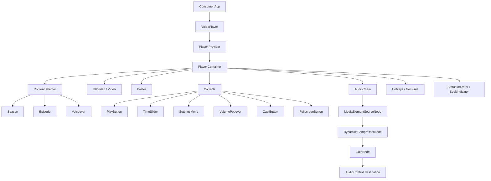

### A React video player powered by Video.js.

HLS streaming, accessible controls, audio processing, and skin support — ready to embed in minutes.

[Quick Start](#quick-start) · [Usage](#usage) · [API](#public-api) · [Development](#development) · [Backend](https://github.com/leo-need-more-coffee/evadeplayer-platform)

[](https://react.dev)
[](https://videojs.com)
[](https://www.typescriptlang.org)
[](https://vite.dev)
[](LICENSE)

## About

EvadePlayer is a React-based video player built on [Video.js v10](https://videojs.com).

It provides a full-featured playback UI with:

- HLS streaming via hls.js
- Accessible controls (keyboard, screen reader, focus management)
- Audio volume boost and dynamic range compression
- Subtitle appearance customization
- Picture-in-picture, fullscreen, cast
- Thumbnail storyboard previews on the timeline
- Hotkeys and gestures
- Pluggable skin system
- Season, episode, and voiceover selector in the top-right corner

This is the **frontend** — the player UI. The backend that handles uploading, transcoding, and serving video lives in a separate repository:

> [github.com/leo-need-more-coffee/evadeplayer-platform](https://github.com/leo-need-more-coffee/evadeplayer-platform)  
> Go + ffmpeg + nginx — upload, transcode to HLS, serve with signed URLs


## Quick Start

```bash
npm install evade-player
```

```tsx
import { VideoPlayer } from 'evade-player';
import 'evade-player/skins/default/skin.css';

function App() {
  return (
    <VideoPlayer
      src="https://example.com/video.m3u8"
      poster="https://example.com/poster.jpg"
    />
  );
}
```

### Dev server with demo app

```bash
git clone https://github.com/leo-need-more-coffee/evadeplayer-platform.git
cd evadeplayer-platform
npm ci
npm run dev
```

The demo app will be available at `http://localhost:5173`.


## Usage

### Basic

```tsx
import { VideoPlayer } from 'evade-player';

<VideoPlayer
  src="https://stream.mux.com/abc123/highlight.mp4"
  poster="https://image.mux.com/abc123/thumbnail.webp"
/>
```

### With quality selection

```tsx
<VideoPlayer
  src="https://example.com/master.m3u8"
  qualities={[
    { label: '1080p', src: 'https://example.com/1080.m3u8' },
    { label: '720p',  src: 'https://example.com/720.m3u8' },
    { label: '480p',  src: 'https://example.com/480.m3u8' },
  ]}
/>
```

### With thumbnail storyboard

```tsx
<VideoPlayer
  src="https://example.com/master.m3u8"
  thumbnailStoryboardSrc="https://example.com/video/storyboard"
/>
```

The storyboard endpoint should return a JSON array:

```json
[
  { "url": "https://example.com/sprite.jpg", "start_time": 0, "end_time": 10 },
  { "url": "https://example.com/sprite.jpg", "start_time": 10, "end_time": 20 }
]
```

### With season, episode, and voiceover selection

```tsx
<VideoPlayer
  src="https://example.com/master.m3u8"
  seasons={[
    {
      label: 'Season 1',
      value: 's1',
      episodes: [
        { label: 'Episode 1', value: 's1e1' },
        { label: 'Episode 2', value: 's1e2' },
      ],
    },
    {
      label: 'Season 2',
      value: 's2',
      episodes: [
        { label: 'Episode 1', value: 's2e1' },
      ],
    },
  ]}
  currentSeason="s1"
  currentEpisode="s1e1"
  onSeasonChange={(value) => console.log('Season:', value)}
  onEpisodeChange={(value) => console.log('Episode:', value)}
  voiceovers={[
    { label: 'Russian', value: 'ru' },
    { label: 'English', value: 'en' },
    { label: 'Japanese', value: 'ja' },
  ]}
  currentVoiceover="ru"
  onVoiceoverChange={(value) => console.log('Voiceover:', value)}
/>
```

All props are optional. The episodes dropdown automatically shows episodes from the selected season. Selectors appear in the top-right corner.

### Audio boost and normalization

```tsx
import { applyVolumeBoost, applyNormalization } from 'evade-player';

applyVolumeBoost(2);       // 2x gain
applyNormalization('light'); // 'off' | 'light' | 'medium' | 'strong'
```

### Iframe embedding

```html
<iframe
  src="https://your-player-host/?id=VIDEO_ID&token=TOKEN&expires=UNIX_TS&codec=av1"
  width="100%"
  height="100%"
  allow="autoplay; fullscreen; picture-in-picture"
  allowfullscreen
></iframe>
```

Parameters:

| Param     | Description                |
|-----------|----------------------------|
| `id`      | Video ID                   |
| `token`   | Signed access token        |
| `expires` | Token expiration timestamp |
| `codec`   | Preferred codec            |

---

## Public API

### Components

| Export        | Description                           |
|---------------|---------------------------------------|
| `VideoPlayer` | Main player component                 |
| `Player`      | Video.js store (Provider + Container) |

### Types

| Export                  | Description                |
|-------------------------|----------------------------|
| `VideoPlayerProps`      | Player component props     |
| `QualityOption`         | Quality variant option     |
| `SeasonOption`          | Season selection option (with nested episodes) |
| `VoiceoverOption`       | Voiceover / dub option     |
| `SubtitleOption`        | Subtitle track option      |
| `AudioOption`           | Audio track option         |
| `SubtitleAppearance`    | Subtitle style settings    |
| `SubtitleSettingOption` | Subtitle style option      |
| `AudioChainDebugInfo`   | Audio chain debug state    |

### Audio Functions

| Export                    | Description                                    |
|---------------------------|------------------------------------------------|
| `applyVolumeBoost`        | Set gain factor (0.5, 1, 2, 3…)                |
| `applyNormalization`      | Set compressor level (off/light/medium/strong) |
| `resumeOnUserInteraction` | Resume AudioContext on user gesture            |
| `setMediaElement`         | Attach a media element to the chain            |
| `getAudioChainDebugInfo`  | Get current audio chain state                  |

### Preset Constants

| Export                         | Description                 |
|--------------------------------|-----------------------------|
| `VOLUME_BOOST_OPTIONS`         | Boost preset list (50–300%) |
| `NORMALIZATION_OPTIONS`        | Level preset list           |
| `DEFAULT_VOLUME_BOOST`         | Default boost value         |
| `DEFAULT_NORMALIZATION`        | Default normalization level |
| `DEFAULT_SUBTITLE_APPEARANCE`  | Default subtitle style      |
| `SUBTITLE_FONT_SIZE_OPTIONS`   | Font size presets           |
| `SUBTITLE_COLOR_OPTIONS`       | Text color presets          |
| `SUBTITLE_BG_OPTIONS`          | Background color presets    |
| `SUBTITLE_EDGE_STYLE_OPTIONS`  | Edge style presets          |
| `SUBTITLE_FONT_FAMILY_OPTIONS` | Font family presets         |
| `SUBTITLE_POSITION_OPTIONS`    | Position presets            |

---

## Architecture



---

## Browser Support

| Browser         | Supported |
|-----------------|-----------|
| Chrome          | ✅ 90+     |
| Firefox         | ✅ 90+     |
| Safari          | ✅ 15+     |
| Edge (Chromium) | ✅ 90+     |
| iOS Safari      | ✅ 15+     |
| Android Chrome  | ✅ 90+     |

---

## Development

### Setup

```bash
npm ci
npm run dev
```

### Scripts

```bash
npm run dev       # Start dev server
npm run build     # Build library (JS + CSS + types)
npm run preview   # Preview production build
npm run lint      # Run ESLint
```

### ENV Configuration (demo app)

```dotenv
VITE_VIDEO_PROVIDER_HOST=http://10.88.88.2
VITE_VIDEO_PROVIDER_PROXY_PATH=/hls-proxy
VITE_VIDEO_POSTER_PATH=/thumbnails
VITE_DEFAULT_VIDEO_ID=3fb87d2e-b294-4c4e-a937-9be65496e1f7
VITE_HARDCODED_STREAM_URL=
```

`VITE_HARDCODED_STREAM_URL` is an optional override — if set, the player ignores all URL parameters and uses it directly.

### Docker

```bash
docker compose up --build
```

Host port can be set with `VITE_PORT`:

```bash
VITE_PORT=4173 docker compose up --build
```

---

## Related

| Project | Description |
|---------|-------------|
| [evadeplayer-platform](https://github.com/leo-need-more-coffee/evadeplayer-platform) | Go backend — upload, transcode to HLS, signed URLs |

---

## License

[MIT](LICENSE)
